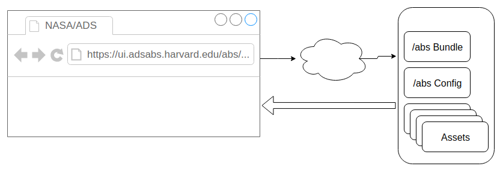
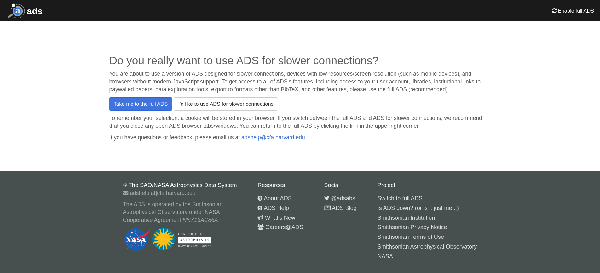

# State of the UI

### ADSUG November 20-21 2019

--

Tim Hostetler

---

## Part I: Areas of concern

- Loading Speed
- Access
  - Crawlers
  - Non-JS users
  - Reference Managers (Zotero, etc.)

Notes:
Areas of concern from the last meeting, setting up for talking about how we addressed them.

---

## Improving Loading Speed

- Lazy-loaded assets
- Route-based bundling
  

Notes:
get some GA data on this to show the difference. Also, get size of download before and after

---

## Improving Access

### ADS CORE

---

## ADS CORE

Notes:
Quick image to show the splash screen

---

## ADS CORE

<video width="600" height="400" controls alt="adscore showcase">
  <source src="./imgs/adscore-showcase.mp4" type="video/mp4">
</video>

Notes:
Video showing the speed of ADS Core

---

## ADS CORE

- Server-rendered (like classic)
- No JavaScript necessary
- Mobile-friendly
- Quickly switch back and forth

- No user accounts
- No "extra" features
  - Results page side-bars (facets, citation date, etc.)
  - Libraries, ORCiD, etc.

Notes:
Pros/cons, ADS Core is about providing access to the service for restricted users
or special cases (crawlers, reference managers)

---

## Improving Access

### Abstract Page Hydration

<video width="600" height="400" controls alt="adscore hydration">
  <source src="./imgs/adscore-hydration.mp4" type="video/mp4">
</video>

Notes:
Showcase it first here, then describe in next slide

---

## Abstract Page Hydration

- Instant response from server
- Crawlers, reference managers have access to metadata
- Full ADS "Hydrated" via JavaScript

Notes:
Short description of hydration

---

## Part II: Enhancements

- Second Order Operations
- Cleaner URLs (no more hashes)
- Classic Parity
  - Reference Resolver
  - Library Set Operations

Notes:
Short descriptions, primers to the videos

---

## Second Order Operations

<video width="600" height="400" controls alt="second order operations showcase">
  <source src="./imgs/second-order-showcase.mp4" type="video/mp4">
</video>

Notes:
Limit to also available from the library.
Docs() operator is now used everywhere in the place of "bigquery"

---

## Reference Resolver

<video width="600" height="400" controls alt="reference resolver showcase">
  <source src="./imgs/reference-resolver-showcase.mp4" type="video/mp4">
</video>

Notes:
Works the same way the classic reference resolver worked

---

## Library Set Operations

<video width="600" height="400" controls alt="reference resolver showcase">
  <source src="./imgs/library-operations-showcase.mp4" type="video/mp4">
</video>

Notes:
There are five main operations available, and the interface guides the user.

---

## Part III: Challenges

- Outdated JavaScript Frameworks/Libraries
- Accessibility/Usability
- Lack of extra UI/UX developer(s)

Notes:
Since last meeting, we've kept our focus on making the transition to the new interface as seamless as possible.
Some of the challenges we mentioned last time still exist

---

## Future Work

- Progressive Enhancement
  - Rewriting the UI
- Harvard Web Publishing
  - Usability Studies, designs

Notes:
We have been doing a slow transition internally to a more modern framework one piece at a time.
Reached out to a contracting service to fill in the gap in UI/UX skillset

---

## Progressive Enhancement

- All new features written in modern framework
- Slowly transition each area
- Clean up and modularize current structure

Notes:

---

## Future Work

- Rewrite still in the works
- Should be able to reuse new code

Notes:

---

## Questions?
